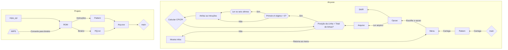

Visão Geral

Alguns links que podem ajudar caso for usar o projeto:

Opcodes das instruções em MIPS: https://opencores.org/projects/plasma/opcodes

Imagem com o número de ciclos das Instruções: (para o calculo do CPI)

Se precisar de ajuda, me chama no linkedIn: https://www.linkedin.com/in/felpsds/
